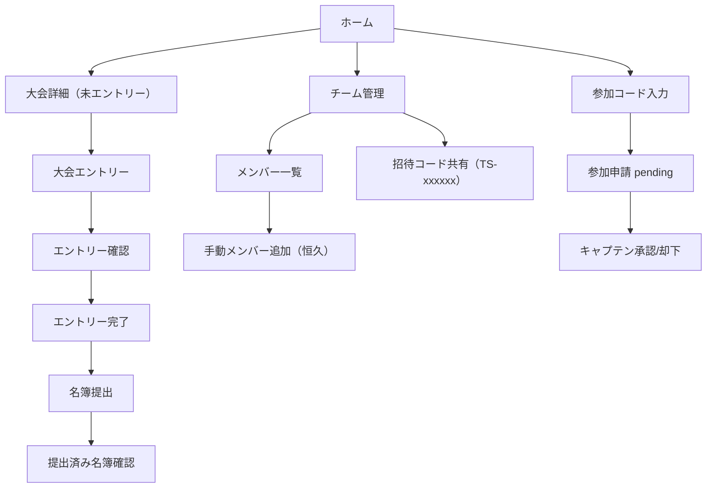
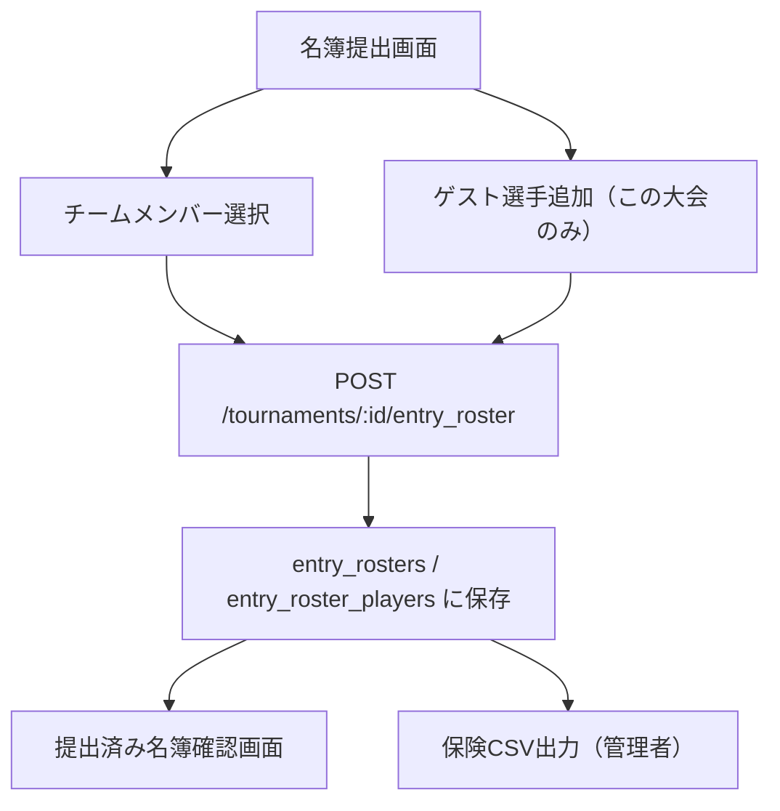
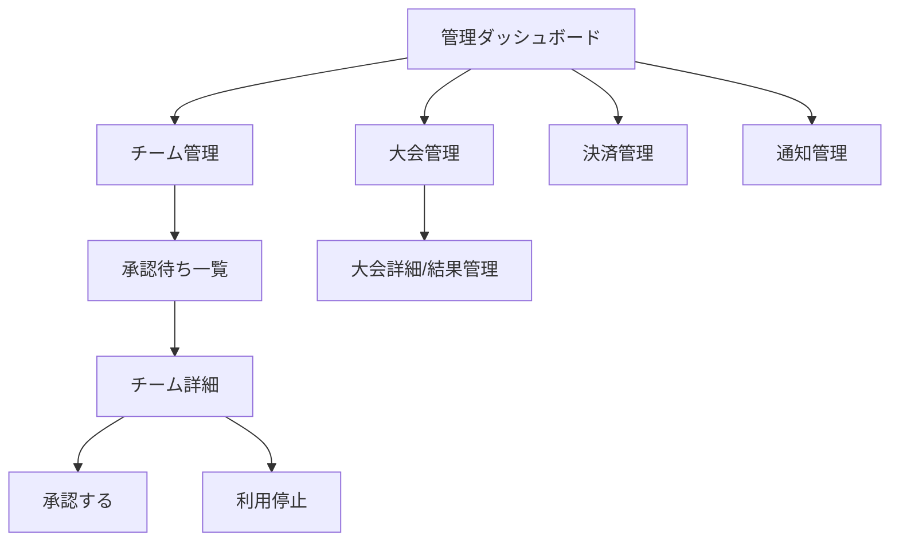

# 画面遷移 / 業務フロー（実装同期版）

最終更新: 2026-02-26

## 一般ユーザー

## 名簿提出フロー（恒久メンバーと大会限定ゲストの分離）

## 管理者

## 補足ルール
- チーム作成・メンバー追加は `approval_status=pending` でも可能
- 大会エントリーはチーム承認状態に依存（未承認チームは制限）
- 名簿提出のゲストは大会限定で、チーム一覧/チームメンバーへ混入しない
- 招待コードは `TS-xxxxxx`（6桁ランダム数字）を使用
