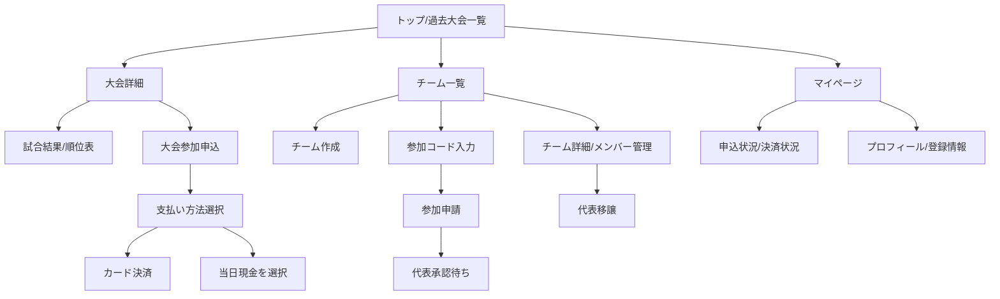
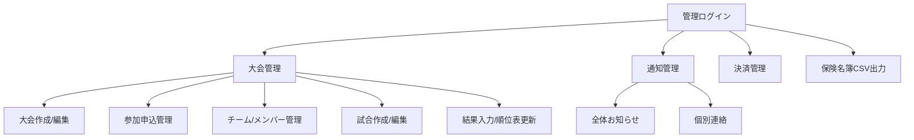

# 画面遷移図（MVP）

## 一般画面

```mermaid
flowchart TD
  A[トップ/過去大会一覧] --> B[大会詳細]
  B --> C[試合結果/順位表]

  A --> D[チーム一覧]
  D --> E[チーム作成]
  D --> F[参加コード入力]
  F --> G[参加申請]
  G --> H[代表承認待ち]

  D --> I[チーム詳細/メンバー管理]
  I --> J[代表移譲]

  B --> K[大会参加申込]
  K --> L[支払い方法選択]
  L --> M[カード決済]
  L --> N[当日現金を選択]

  A --> O[マイページ]
  O --> P[申込状況/決済状況]
  O --> Q[プロフィール/登録情報]
```

## 運営画面

```mermaid
flowchart TD
  A1[管理ログイン] --> B1[大会管理]
  B1 --> C1[大会作成/編集]
  B1 --> D1[参加申込管理]
  B1 --> E1[チーム/メンバー管理]
  B1 --> F1[試合作成/編集]
  B1 --> G1[結果入力/順位表更新]

  A1 --> H1[通知管理]
  H1 --> I1[全体お知らせ]
  H1 --> J1[個別連絡]

  A1 --> K1[決済管理]
  A1 --> L1[保険名簿CSV出力]
```

## 主要フロー補足
- チーム参加
- 参加者が参加コードを入力して申請
- 代表が承認するとチーム参加確定
- 代表または運営が代表移譲可能
- 大会参加
- チーム単位で大会参加申込
- 運営のみが承認/却下
- 決済
- 事前カード決済または当日現金を選択
- 当日現金は支払い方法として登録する

